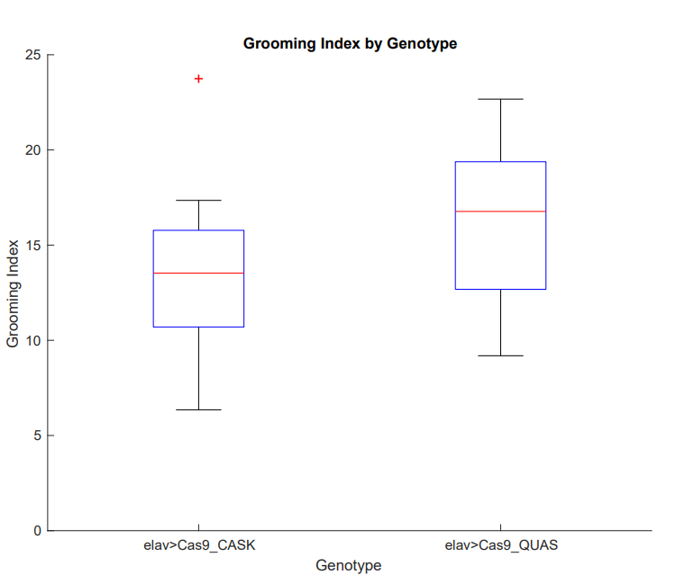
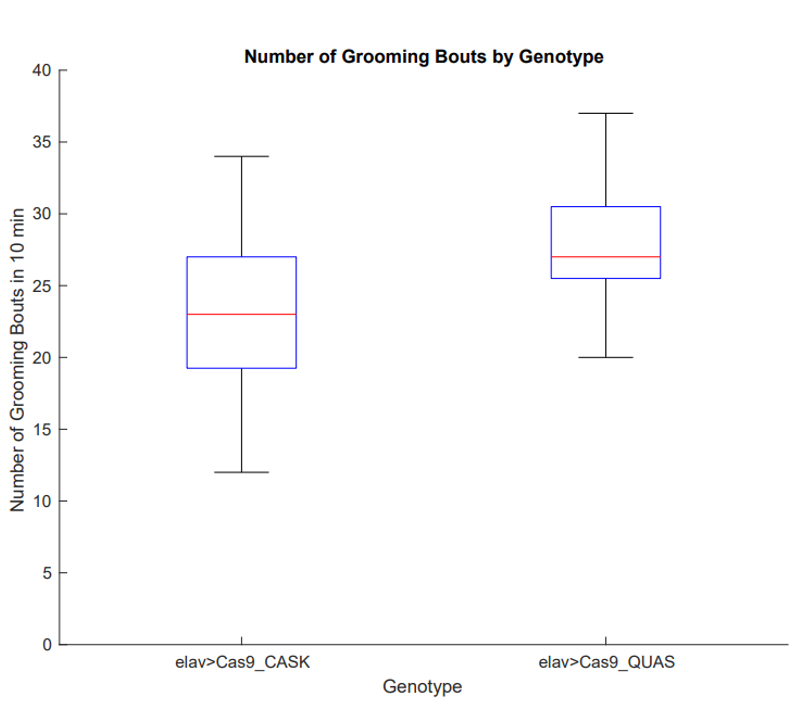
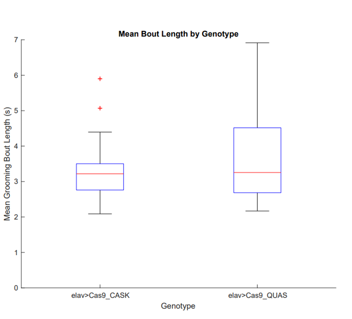
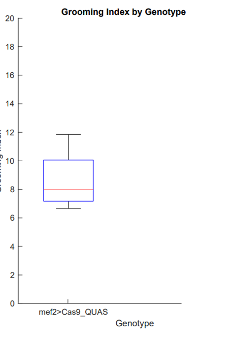
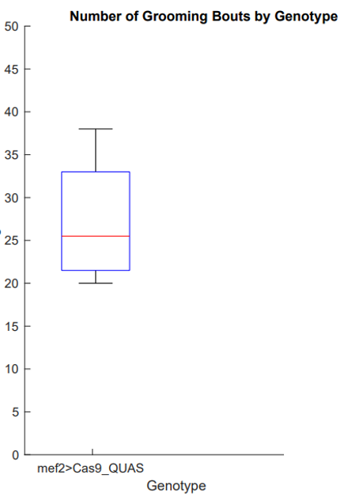
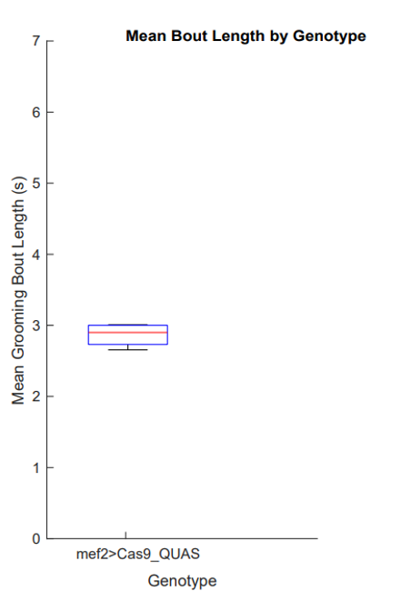

# Bioinformatics, Data Science Research Project

This Figure shows the Box plots of the values of number of grooming index values of the Elav>Cas9 x CASK and Elav>Cas9 x QUAS represented using Box-and-whisker plots. The blue box shows the 25th-75th percentiles; the red line in the box shows the median. The black lines, extending form the blue box, with the whiskers represent the 9th and the 91th. (p-value=0.0859). This box plot was constructed with 17 Elav>Cas9 x CASK (11 females and 6 males) and 24 Elav>Cas9 x QUAS (12 females and 12 males).

This Figure shows Box plots of the values of the number of grooming bouts done by Elav>Cas9 x CASK and Elav>Cas9 x QUAS represented using Box-and-whisker plots. The blue box shows the 25th-75th percentiles; in the red line in the box shows the median. The black lines, extending form the blue box, with the whiskers represents the 9th and the 91th. (p-value 0.0469). This box plot was constructed with 17 Elav>Cas9 x CASK (11 females and 6 males) and 24 Elav>Cas9 x QUAS (12 females and 12 males).

This Figure shows Box plots of the values of the mean bout length done by Elav>Cas9  x CASK and Elav>Cas9 x QUAS represented using Box-and-whisker plots. The blue box shows the 25th-75th percentiles; in the red line in the box shows the median. The black lines, extending form the blue box, with the whiskers represents the 9th and the 91th. (p-value=0.7399). This box plot was constructed with 17 Elav>Cas9 x CASK (11 females and 6 males) and 24 Elav>Cas9 x QUAS (12 females and 12 males).

Figure 7 Box plots of the values of number of grooming index values of the Mef2>Cas9 x QUAS represented using Box-and-whisker plots. The blue box shows the 25th-75th percentiles; in the red line in the box shows the median. The black lines, extending form the blue box, with the whiskers represents the 9th and the 91th. This box plot was constructed with 4 Mef2>Cas9 x QUAS (2 males and 2 females)

This Figure shows Box plots of the values of number of grooming index values of the Mef2>Cas9 x QUAS represented using Box-and-whisker plots. The blue box shows the 25th-75th percentiles; in the red line in the box shows the median. The black lines, extending form the blue box, with the whiskers represents the 9th and the 91th. This box plot was constructed with 4 Mef2>Cas9 x QUAS (2 males and 2 females)

This Figure shows Box plots of the values of number of grooming bouts values of the Mef2>Cas9 x QUAS represented using Box-and-whisker plots. The blue box shows the 25th-75th percentiles; in the red line in the box shows the median. The black lines, extending form the blue box, with the whiskers represents the 9th and the 91th. This box plot was constructed with 4 Mef2>Cas9 x QUAS (2 males and 2 females)

This Figure shows Box plots of the values of mean bout length values of the Mef2>Cas9 x QUAS represented using Box-and-whisker plots. The blue box shows the 25th-75th percentiles; in the red line in the box shows the median. The black lines, extending form the blue box, with the whiskers represents the 9th and the 91th. This box plot was constructed with 4 Mef2>Cas9 x QUAS (2 males and 2 females)
